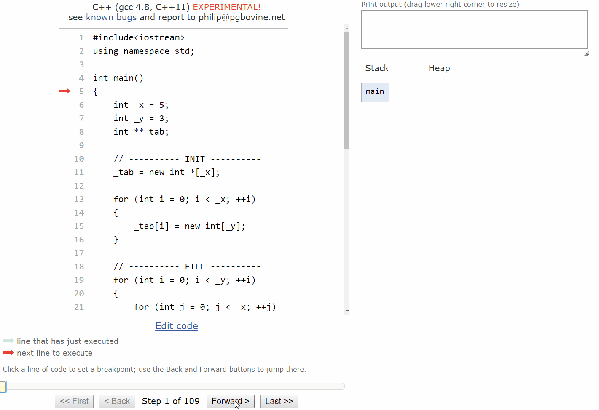

# generic 2D matrix class (exercise 7.3)
---------------------
Let's try to build a 2d matrix that is able to handle all sorts of types. The size of this bad guy is choosed by the user.

for example, he should be able to type in:

```c++
Matrix<float> m1(3, 4);
``` 

This instruction gonna create a Matrix that holds floats and is composed of 3 lignes and4 columns.

## todo:

- copy cstr
- **`OL operator =`** that allows operations like **`matrixInt1 = matrixInt2`**
- a second OL of **`operator =`** that'll allows to fill up a matrix with the same value.

- a show() method that'll show the type of the elements stored and the content of the matrix.

- like the generic linked list, it should be able to work with basic types and custom classes. 

- in particular it should work with the "chaine" type (kind of string type) made a couple of months ago and the Pixel type that is on of the first type that takes benefit of the inheritence that I've made in c++.


### Personal notes:
- Ok, so I think I gonna start to make a non generic type of matrix that works with int type, and I'll see from there.
----
- I had some troubles with the basic logic of the building/filling/displaying/cleaning. I made a simple model and have done some tests to wrap my head around it and be clear:

